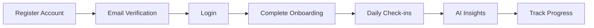

# WellnessAI Platform - Complete API Documentation & User Guide

## 🎯 System Overview

WellnessAI is a comprehensive employee wellness platform powered by AI that helps organizations monitor and improve workplace mental health. The system features daily mood tracking, AI-powered insights, HR analytics, and automated wellness recommendations.

### Current System Status: **Production Ready** ✅

- **Phase 1-4 Complete**: Authentication, Check-ins, Profile Management, Onboarding, HR Analytics, AI Features
- **All Core Features**: Fully implemented and tested
- **AI Integration**: OpenAI GPT-4o-mini providing real-time analysis
- **Database**: MongoDB with optimized schemas and indexes
- **Security**: JWT authentication, role-based access, rate limiting

---

## 🔄 User Flow & Journey

### 1. **Employee Onboarding Flow**



1. **Registration**: Employee signs up with company email
2. **Email Verification**: Verify email to activate account
3. **Onboarding Questionnaire**: Personalize wellness experience
4. **Daily Check-ins**: Track mood and receive Happy Coins
5. **AI Analysis**: Get personalized insights and recommendations
6. **Progress Tracking**: Monitor wellness journey

### 2. **Daily Usage Flow**

```
Morning:
- Receive check-in reminder (email/WhatsApp)
- Complete mood check-in (1-5 scale + feedback)
- Earn Happy Coins
- Receive AI-generated motivational message

Throughout Day:
- Access personalized insights
- View wellness statistics
- Track mood trends

Weekly:
- Receive AI-generated weekly summary
- Review progress and achievements
- Get new wellness recommendations
```

### 3. **HR Dashboard Flow**

```
HR Manager:
- Login with HR credentials
- View company-wide analytics
- Identify at-risk employees
- Generate department reports
- Export data for meetings
- Monitor engagement rates
```

---

## 📚 Complete API Endpoints Documentation

### Base URLs
- **Development**: `http://localhost:8005/api`
- **Production**: `https://your-domain.com/api`

### Authentication
All protected endpoints require JWT token in header:
```
Authorization: Bearer <your-jwt-token>
```

---

## 🔐 1. Authentication Endpoints

### 1.1 Register New User
**POST** `/api/auth/register`

**Request:**
```json
{
  "name": "John Doe",
  "email": "john.doe@company.com",
  "password": "SecurePass123",
  "employeeId": "EMP001",
  "department": "Engineering",
  "phone": "1234567890"
}
```

**Response (201):**
```json
{
  "success": true,
  "message": "Account created successfully! Please check your email to verify your account.",
  "data": {
    "user": {
      "id": "64f7a1b2c3d4e5f6789012ab",
      "name": "John Doe",
      "email": "john.doe@company.com",
      "employeeId": "EMP001",
      "department": "Engineering",
      "role": "employee",
      "isEmailVerified": false
    }
  }
}
```

### 1.2 Login
**POST** `/api/auth/login`

**Request:**
```json
{
  "email": "john.doe@company.com",
  "password": "SecurePass123"
}
```

**Response (200):**
```json
{
  "success": true,
  "message": "Login successful",
  "data": {
    "user": {
      "id": "64f7a1b2c3d4e5f6789012ab",
      "name": "John Doe",
      "department": "Engineering"
    },
    "accessToken": "eyJhbGciOiJIUzI1NiIsInR5cCI6IkpXVCJ9...",
    "tokenType": "Bearer",
    "expiresIn": "7d"
  }
}
```

### 1.3 Get Profile
**GET** `/api/auth/profile` 🔒

**Response (200):**
```json
{
  "success": true,
  "data": {
    "user": {
      "id": "64f7a1b2c3d4e5f6789012ab",
      "name": "John Doe",
      "email": "john.doe@company.com",
      "department": "Engineering",
      "wellness": {
        "happyCoins": 850,
        "currentStreak": 5,
        "averageMood": 4.2,
        "riskLevel": "low"
      },
      "onboarding": {
        "completed": true
      }
    }
  }
}
```

---

## 📱 2. Daily Check-in Endpoints

### 2.1 Create Check-in
**POST** `/api/checkins` 🔒

**Request:**
```json
{
  "mood": 4,
  "feedback": "Had a productive day with good team collaboration",
  "source": "web"
}
```

**Response (201):**
```json
{
  "success": true,
  "message": "Check-in completed successfully!",
  "data": {
    "checkIn": {
      "id": "64f7a1b2c3d4e5f6789012ac",
      "mood": 4,
      "moodLabel": "Good",
      "feedback": "Had a productive day with good team collaboration",
      "happyCoinsEarned": 85,
      "streakAtCheckIn": 5,
      "date": "2025-07-25"
    },
    "user": {
      "totalHappyCoins": 935,
      "currentStreak": 5
    }
  }
}
```

**Note**: AI analysis happens automatically in background!

### 2.2 Today's Status
**GET** `/api/checkins/today` 🔒

**Response (200):**
```json
{
  "success": true,
  "message": "Check-in completed for today",
  "data": {
    "checkedInToday": true,
    "checkIn": {
      "mood": 4,
      "moodLabel": "Good",
      "happyCoinsEarned": 85
    },
    "nextCheckIn": "2025-07-26T09:00:00.000Z"
  }
}
```

### 2.3 Check-in History
**GET** `/api/checkins?page=1&limit=10` 🔒

**Response (200):**
```json
{
  "success": true,
  "data": {
    "checkIns": [
      {
        "id": "64f7a1b2c3d4e5f6789012ac",
        "mood": 4,
        "moodLabel": "Good",
        "feedback": "Productive day",
        "date": "2025-07-25",
        "happyCoinsEarned": 85,
        "analysis": {
          "sentimentScore": 0.8,
          "emotions": ["satisfied", "motivated"],
          "personalizedMessage": "Great job maintaining your positive momentum!"
        }
      }
    ],
    "pagination": {
      "currentPage": 1,
      "totalPages": 5,
      "totalCount": 45
    }
  }
}
```

---

## 🤖 3. AI-Powered Endpoints

### 3.1 Test AI Connection
**GET** `/api/ai/test` 🔒

**Response (200):**
```json
{
  "success": true,
  "message": "AI service connection successful",
  "data": {
    "response": "OpenAI connection test successful.",
    "model": "gpt-4o-mini",
    "isEnabled": true
  }
}
```

### 3.2 Get Personalized Insights
**GET** `/api/ai/insights` 🔒

**Response (200):**
```json
{
  "success": true,
  "message": "Personalized insights generated successfully",
  "data": {
    "insights": {
      "overallAssessment": "Your wellness journey shows positive momentum with consistent engagement.",
      "patterns": [
        "Regular afternoon energy dips",
        "Strong Monday motivation"
      ],
      "recommendations": [
        {
          "category": "Energy Management",
          "title": "Afternoon Break Strategy",
          "description": "Take a 10-minute walk between 2-3 PM",
          "priority": "high"
        }
      ],
      "motivationalMessage": "You're doing great! Your consistency is building lasting wellness habits.",
      "strengths": ["Consistent check-ins", "Positive outlook"],
      "improvementAreas": ["Stress management", "Work-life balance"]
    }
  }
}
```

### 3.3 Weekly AI Summary
**GET** `/api/ai/summary/weekly` 🔒

**Response (200):**
```json
{
  "success": true,
  "data": {
    "statistics": {
      "totalCheckIns": 5,
      "averageMood": 3.8,
      "happyCoinsEarned": 425
    },
    "aiSummary": {
      "weekOverview": "You maintained steady wellness with 5 out of 7 check-ins completed.",
      "highlights": [
        "Mood improved 20% from last week",
        "Earned streak bonus on Wednesday"
      ],
      "moodPatterns": "Your mood tends to be highest mid-week",
      "nextWeekRecommendations": [
        "Try morning meditation on Mondays",
        "Schedule breaks during busy afternoons"
      ]
    }
  }
}
```

---

## 👤 4. Profile Management Endpoints

### 4.1 Update Profile
**PUT** `/api/profile` 🔒

**Request:**
```json
{
  "name": "John Updated",
  "phone": "9876543210",
  "department": "Product"
}
```

### 4.2 Update Preferences
**PUT** `/api/profile/preferences` 🔒

**Request:**
```json
{
  "notifications": {
    "checkInReminder": true,
    "preferredChannel": "whatsapp",
    "reminderTime": "09:30"
  },
  "personality": {
    "interests": ["Mental wellness", "Team building"],
    "stressManagement": ["Exercise", "Music"]
  }
}
```

### 4.3 Get Wellness Statistics
**GET** `/api/profile/wellness-stats?period=30` 🔒

**Response (200):**
```json
{
  "success": true,
  "data": {
    "overview": {
      "totalDaysActive": 45,
      "checkInDays": 38,
      "engagementRate": 84,
      "currentStreak": 5,
      "totalHappyCoins": 1850
    },
    "mood": {
      "average": 3.8,
      "weeklyTrend": [
        {"date": "2025-07-19", "mood": 4},
        {"date": "2025-07-20", "mood": 3}
      ]
    }
  }
}
```

---

## 📊 5. HR Analytics Dashboard (HR/Admin Only)

### 5.1 Company Overview
**GET** `/api/analytics/company-overview` 🔒👮

**Response (200):**
```json
{
  "success": true,
  "data": {
    "overview": {
      "totalEmployees": 150,
      "activeEmployees": 128,
      "engagementRate": "85%",
      "averageMood": 3.7,
      "highRiskEmployees": 8
    },
    "departmentBreakdown": [
      {
        "department": "Engineering",
        "employeeCount": 45,
        "averageHappyCoins": 520,
        "averageMood": 3.9
      }
    ]
  }
}
```

### 5.2 Risk Assessment
**GET** `/api/analytics/risk-assessment` 🔒👮

**Response (200):**
```json
{
  "success": true,
  "data": {
    "summary": {
      "totalAtRisk": 12,
      "byRiskLevel": {
        "high": 3,
        "medium": 5,
        "low": 4
      }
    },
    "employees": [
      {
        "employee": {
          "name": "Jane Doe",
          "department": "Sales"
        },
        "risk": {
          "level": "high",
          "score": 8.5
        },
        "indicators": [
          "Low average mood",
          "Infrequent check-ins",
          "Declining trend"
        ]
      }
    ],
    "recommendations": [
      {
        "priority": "urgent",
        "action": "Schedule one-on-one meetings",
        "description": "3 employees need immediate support"
      }
    ]
  }
}
```

---

## 📱 WhatsApp Integration (Planned)

### How WhatsApp Will Enhance Current Endpoints

1. **Check-in via WhatsApp**
   - Send daily reminders at preferred time
   - Users reply with mood number (1-5)
   - Optional: Add text feedback
   - System calls existing `/api/checkins` endpoint with `source: "whatsapp"`

2. **Instant AI Insights**
   - After WhatsApp check-in, receive AI insights immediately
   - Uses existing AI analysis from check-in creation

3. **Weekly Summaries**
   - Automated WhatsApp message every Monday
   - Uses `/api/ai/summary/weekly` endpoint

4. **Quick Commands**
   ```
   User: "status"
   Bot: "Current streak: 5 days 🔥, Happy Coins: 425 💰"
   
   User: "mood"
   Bot: "How are you feeling today? (1-5)"
   User: "4"
   Bot: "Great! Check-in recorded. You earned 85 Happy Coins!"
   ```

### WhatsApp Flow Diagram
```
WhatsApp Message → WellnessAI Bot → Parse Intent → Call API Endpoint → Format Response → Send to User
```

---

## 🚧 Remaining Development Tasks

### Phase 5: Enhanced Features
- [ ] **Weekly Pulse Surveys** - Extended questionnaires for deeper insights
- [ ] **Team Wellness Reports** - Manager dashboards for team health
- [ ] **Wellness Challenges** - Gamified group activities
- [ ] **Resource Library** - Mental health resources and articles

### Phase 6: Integrations
- [ ] **WhatsApp Business API** - Two-way conversational interface
- [ ] **Calendar Integration** - Sync wellness activities
- [ ] **Slack Integration** - Alternative messaging platform
- [ ] **HRIS Integration** - Sync with HR systems

### Phase 7: Advanced Analytics
- [ ] **Predictive Analytics** - AI-powered burnout prediction
- [ ] **Benchmark Reports** - Industry comparison data
- [ ] **Custom Reports** - Configurable analytics dashboards
- [ ] **Real-time Alerts** - Immediate risk notifications

### Phase 8: Rewards & Recognition
- [ ] **Rewards Catalog** - Redeem Happy Coins
- [ ] **Peer Recognition** - Colleague appreciation system
- [ ] **Wellness Badges** - Achievement system
- [ ] **Leaderboards** - Optional competitive elements

---

## 🔧 Technical Implementation Notes

### Current Architecture
```
Frontend (React/Next.js) → API Gateway → Backend Services
                                ↓
                        MongoDB Database
                                ↓
                        AI Service (OpenAI)
```

### Security Features
- JWT with refresh tokens
- Rate limiting (300 req/min)
- Input validation
- Role-based access control
- Encrypted passwords (bcrypt)
- CORS protection

### Performance Optimizations
- Database indexes on frequent queries
- Aggregation pipelines for analytics
- Background AI processing
- Caching for static data
- Pagination for large datasets

---

## 📈 Success Metrics

1. **Engagement Rate**: 85%+ daily check-ins
2. **User Satisfaction**: 4.2+ average mood
3. **Risk Detection**: Early identification of burnout
4. **AI Accuracy**: 90%+ relevant recommendations
5. **Response Time**: <200ms for most endpoints

---

## 🛠️ Development Environment

### Prerequisites
- Node.js 18+
- MongoDB 5.0+
- OpenAI API Key ($10 credit sufficient for testing)

### Environment Variables
```env
# Server
PORT=8005
NODE_ENV=development

# Database
MONGODB_URI=mongodb://localhost:27017/wellness-dev

# JWT
JWT_SECRET=your-secret-key
JWT_REFRESH_SECRET=your-refresh-secret

# Email
EMAIL_HOST=smtp.gmail.com
EMAIL_USER=your-email@gmail.com
EMAIL_PASS=your-app-password

# OpenAI
OPENAI_API_KEY=sk-proj-xxxx
OPENAI_MODEL=gpt-4o-mini

# WhatsApp (Future)
WHATSAPP_API_KEY=pending
WHATSAPP_WEBHOOK_TOKEN=pending
```

---

## 🎯 Quick Start Guide

1. **Clone & Install**
   ```bash
   git clone <repo>
   cd wellness-backend
   npm install
   ```

2. **Configure Environment**
   ```bash
   cp .env.example .env
   # Edit .env with your credentials
   ```

3. **Start Services**
   ```bash
   # Start MongoDB
   mongod

   # Start server
   npm run dev
   ```

4. **Test API**
   ```bash
   curl http://localhost:8005/health
   ```

---

## 📞 Support & Contact

- **Technical Issues**: Create GitHub issue
- **API Questions**: Check this documentation
- **Business Inquiries**: contact@wellnessai.com

---

**Last Updated**: July 25, 2025  
**Version**: 1.0.0  
**Status**: Production Ready 🚀